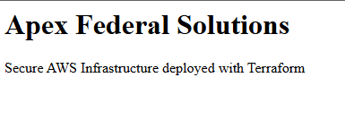
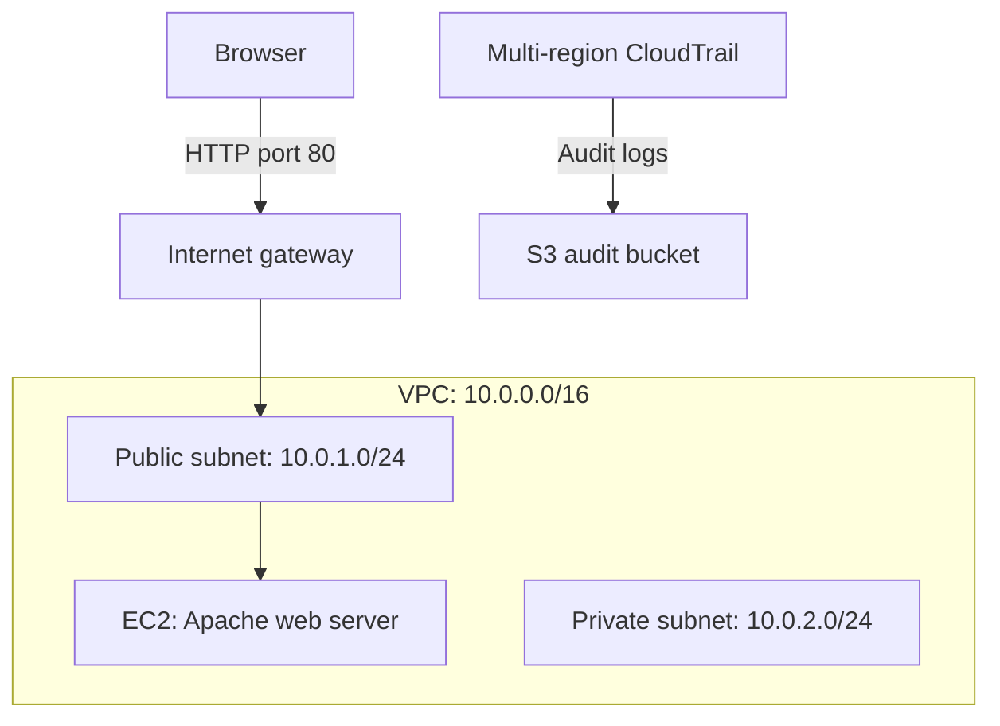

# Building Security-Focused AWS Infrastructure with Terraform

**Author:** Marcus Griffin  
**Repository:** [terraform-aws-secure-infrastructure](https://github.com/Mhscb24/terraform-aws-secure-infrastructure)  
**AWS region:** `us-east-1`  
**AWS provider constraint:** `~> 6.0`

## Project overview

This portfolio lab uses Terraform to define an AWS network, an Apache web server, and an audit logging layer. My goal is to strengthen my infrastructure-as-code skills while learning how network access, encryption, versioning, and API activity logging work together.

The configuration creates public and private subnets, deploys an EC2 instance in the public subnet, and configures a multi-region CloudTrail trail to deliver logs to an S3 bucket with public access blocked.

The fictional organization name **Apex Federal Solutions** appears in resource names and the demo webpage. This is a learning project and does not represent a federal deployment or establish compliance with a regulatory framework.
## Live website

Apache webpage running on the EC2 instance provisioned with Terraform.




## Architecture



The public subnet has an explicit route table with a default route to the internet gateway. Automatic public IP assignment is disabled at the subnet level; the web instance explicitly requests a public IP. The private subnet is provisioned without a workload or NAT gateway in the reviewed configuration. CloudTrail logs AWS API activity separately from the web server's application and access logs.

## Infrastructure and security controls

| Component | Configuration | Purpose |
| --- | --- | --- |
| VPC | `10.0.0.0/16`, DNS support and hostnames enabled | Provides the network boundary |
| Public subnet | `10.0.1.0/24`, `us-east-1a` | Hosts the demo web instance |
| Private subnet | `10.0.2.0/24`, `us-east-1b` | Reserves space for future private workloads |
| Public routing | `0.0.0.0/0` to an internet gateway | Provides an internet route for the public subnet |
| Security group | Inbound TCP 80 from `0.0.0.0/0`; all outbound traffic allowed | Permits public HTTP access to the demo |
| EC2 | `t2.micro`, public IP explicitly enabled | Runs the Apache website |
| EC2 user data | Updates packages, installs `httpd`, enables and starts Apache, writes a demo page | Automates initial web server setup |
| S3 public access block | All four settings enabled | Blocks public access to the audit bucket |
| S3 encryption | Default `AES256` encryption | Encrypts stored objects with SSE-S3 |
| S3 versioning | Enabled | Retains object versions |
| CloudTrail bucket policy | Allows CloudTrail ACL checks and writes under the account's `AWSLogs` path | Supports delivery of audit logs |
| CloudTrail | Multi-region, global service events included, log validation enabled | Supports API activity auditing and integrity validation |

Resources use tags such as `Environment`, `Project`, and `ManagedBy` to make their purpose and ownership easier to identify.

## Repository files

| File | Purpose |
| --- | --- |
| `main.tf` | Network, security group, EC2, S3, bucket policy, and CloudTrail resources |
| `providers.tf` | AWS provider source, version constraint, and region |
| `.terraform.lock.hcl` | Records selected provider versions and checksums |
| `.gitignore` | Excludes local Terraform data, state, variable files, plans, and private keys |
| `README.md` | Project documentation |

Terraform state and backup files remain local and are excluded from Git. Keep them secure: Terraform uses state to manage the deployed resources. The provider lock file is intentionally committed.

## Prerequisites

- Terraform installed. The current configuration does not declare a minimum Terraform version.
- Git installed.
- An AWS account with credentials available through a supported authentication method, such as a configured AWS CLI profile.
- Permissions to manage the resources defined in this lab.
- Review of the configuration, including the hardcoded AMI and instance type, before deployment. AMI availability is region-specific and may change.

Do not place AWS access keys in the Terraform source files.

## Deploy a new copy

These steps are for a new deployment. If you already applied this project, continue using the original project directory and its state; a fresh clone does not include your existing local state.

```powershell
git clone https://github.com/Mhscb24/terraform-aws-secure-infrastructure.git
cd terraform-aws-secure-infrastructure
terraform init
terraform fmt -check
terraform validate
terraform plan
```

Review the plan's additions, changes, and deletions. When the plan matches the intended deployment, run:

```powershell
terraform apply
```

Review the displayed plan and enter `yes` to proceed. Creating resources can incur AWS charges.

## Verification checklist

Use this checklist to verify the deployment and capture evidence. The source code documents intended configuration; successful log delivery and website availability should be confirmed in AWS.

1. Confirm Terraform finishes without errors and inspect the resources with `terraform state list`.
2. Check the EC2 instance is running and passes its status checks.
3. Open `http://<instance-public-ip>` and confirm the Apex Federal Solutions page loads. Allow time for user data to finish installing Apache.
4. Confirm the public subnet's route table has a default route to the internet gateway.
5. Confirm the audit bucket has all public access block settings enabled, default SSE-S3 encryption, and versioning enabled.
6. Confirm CloudTrail logging is active and log objects appear beneath the bucket's `AWSLogs` prefix. Delivery may take time.
7. Confirm the trail has multi-region logging and log validation enabled. Enabling validation is separate from actually validating delivered log files.
8. Run `terraform plan` again and check whether Terraform reports any unexpected changes.

Useful screenshots include the rendered website, Terraform apply result, S3 security settings, CloudTrail status, and delivered log objects. Remove credentials and sensitive identifiers before publishing evidence.

## What I learned

- How to express AWS resource relationships with Terraform references.
- How subnet routing and instance-level public IP settings affect connectivity.
- How EC2 user data automates a repeatable server setup.
- How S3 public access controls, encryption, and versioning support audit log storage.
- How a service-specific bucket policy enables CloudTrail log delivery.
- Why Terraform state must be protected while provider lock files belong in version control.
- How to review a Git repository's root and staged files before uploading a project.

## Current limitations and future improvements

This is a foundational lab. The demo uses public HTTP without TLS, permits unrestricted outbound traffic, and runs a single web instance. A private subnet by itself does not provide a complete application architecture.

Future improvements include HTTPS, reusable variables and outputs, an explicit Terraform version constraint, secure remote state with locking, EC2 hardening, and automated formatting and validation checks. Audit improvements could include a bucket policy requiring TLS, a CloudTrail source-ARN condition, retention policies, and an evaluated log immutability strategy. Versioning alone does not prevent an authorized user from deleting object versions.

## Cleanup and cost management

Retain any evidence you need before removing resources. From the original directory containing this deployment's Terraform state, preview cleanup:

```powershell
terraform plan -destroy
```

When the deletion list contains only resources you intend to remove:

```powershell
terraform destroy
```

Review the plan and confirm when ready. The versioned audit bucket may prevent cleanup if it contains logs. If intentionally deleting it, remove all object versions and delete markers after preserving needed evidence, then retry cleanup. The reviewed bucket resource does not enable `force_destroy`.

Confirm resources are removed in AWS and review billing for remaining usage. EC2, public IPv4 addresses, S3 storage and requests, and CloudTrail usage can incur charges; do not assume this lab is free.
